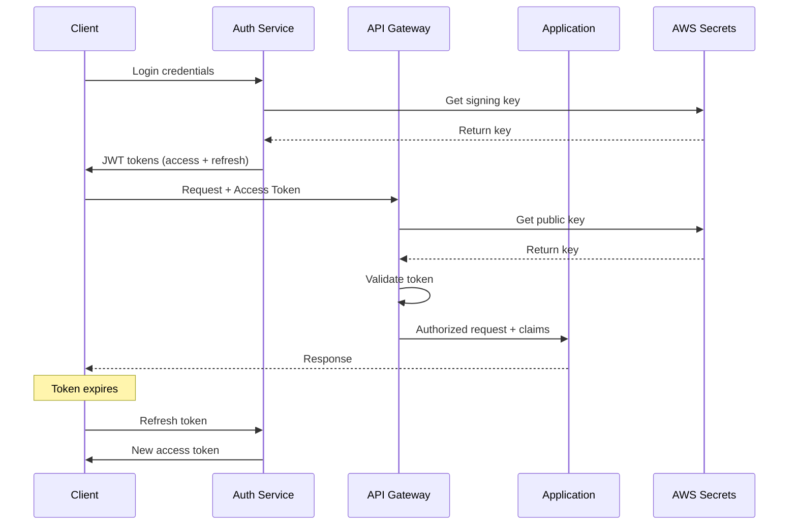

# JWT Token Security in AWS Environments

This document provides comprehensive guidance for implementing JWT token security in AWS-deployed applications, covering authentication, authorization, token management, and AWS-specific security considerations.

## Table of Contents

- [Overview](#overview)
- [JWT Token Fundamentals](#jwt-token-fundamentals)
- [AWS Security Architecture](#aws-security-architecture)
- [Token Management Strategy](#token-management-strategy)
- [Implementation Patterns](#implementation-patterns)
- [AWS Service Integration](#aws-service-integration)
- [Security Best Practices](#security-best-practices)
- [Monitoring and Compliance](#monitoring-and-compliance)
- [Troubleshooting](#troubleshooting)

## Overview

JWT (JSON Web Token) security in AWS environments requires careful consideration of token lifecycle, key management, validation, and integration with AWS services. This guide covers production-ready patterns for Clean Architecture applications.

### Security Objectives

1. **Authentication**: Verify user identity through secure token validation
2. **Authorization**: Control access to resources based on token claims
3. **Token Integrity**: Ensure tokens cannot be tampered with
4. **Key Security**: Protect signing keys and rotation strategies  
5. **Compliance**: Meet security standards (SOC2, GDPR, HIPAA)
6. **Observability**: Monitor authentication events and security metrics

## JWT Token Fundamentals

### Token Structure

```
Header.Payload.Signature
```

**Header Example:**
```json
{
  "alg": "RS256",
  "typ": "JWT",
  "kid": "key-id-2024-01"
}
```

**Payload Example:**
```json
{
  "iss": "https://auth.yourapp.com",
  "sub": "user_123456",
  "aud": "https://api.yourapp.com", 
  "exp": 1736380800,
  "iat": 1736294400,
  "jti": "token_uuid_here",
  "scope": "read:orders write:orders",
  "user_id": "user_123456",
  "email": "user@example.com",
  "roles": ["customer", "premium"],
  "tenant_id": "org_abc123"
}
```

### Token Types

| Type | Purpose | Lifetime | Storage |
|------|---------|----------|---------|
| Access Token | API authorization | 15-60 minutes | Memory/localStorage |
| Refresh Token | Token renewal | 30-90 days | Secure httpOnly cookie |
| ID Token | User identity | Same as access | Memory only |

## AWS Security Architecture

### High-Level Architecture

```
┌─────────────────┐    ┌──────────────────┐    ┌─────────────────┐
│   Client App    │    │   API Gateway    │    │   ECS/Lambda    │
│                 │    │                  │    │   Services      │
│ - Store tokens  │───▶│ - JWT validation │───▶│ - Claims-based  │
│ - Auto refresh  │    │ - Rate limiting  │    │   authorization │
│ - Secure trans  │    │ - CORS policies  │    │ - Business logic│
└─────────────────┘    └──────────────────┘    └─────────────────┘
         │                       │                       │
         │                       ▼                       │
         │              ┌──────────────────┐             │
         │              │  AWS Cognito     │             │
         │              │                  │             │
         └──────────────│ - User pools     │◀────────────┘
                        │ - Token issuing  │
                        │ - Key rotation   │
                        └──────────────────┘
                                 │
                                 ▼
                        ┌──────────────────┐
                        │   AWS Secrets    │
                        │   Manager        │
                        │                  │
                        │ - Signing keys   │
                        │ - Certificates   │
                        │ - Key rotation   │
                        └──────────────────┘
```

### Component Responsibilities

**API Gateway:**
- JWT token validation (custom authorizer or built-in)
- Rate limiting per user/token
- Request/response transformation
- CORS policy enforcement

**Application Services (ECS/Lambda):**
- Claims-based authorization
- Business logic execution
- Audit logging with user context
- Token refresh handling

**AWS Cognito:**
- User authentication
- Token issuance and validation
- Built-in security features
- Integration with identity providers

**AWS Secrets Manager:**
- Signing key storage
- Automatic key rotation
- Access control and auditing
- Multi-region replication

## Token Management Strategy

### Token Lifecycle



### Key Management Strategy

**Signing Algorithm: RS256 (Recommended)**
```json
{
  "key_rotation_schedule": "every_30_days",
  "key_storage": "aws_secrets_manager",
  "key_backup": "cross_region_replication",
  "key_access": "iam_role_based",
  "algorithm": "RS256",
  "key_size": 2048
}
```

**Key Rotation Process:**
1. Generate new key pair in AWS Secrets Manager
2. Update token issuer to use new key for signing
3. Maintain old key for validation (30-day overlap)
4. Update API Gateway/services with new public key
5. Remove old key after all tokens expire

### Token Storage Security

**Client-Side Storage:**

| Storage Type | Access Tokens | Refresh Tokens | Security Level |
|--------------|---------------|----------------|----------------|
| Memory | ✅ Recommended | ❌ Lost on refresh | High |
| localStorage | ❌ XSS risk | ❌ Persistent risk | Low |
| sessionStorage | ⚠️ Acceptable | ❌ Lost on tab close | Medium |
| httpOnly Cookie | ❌ CSRF risk | ✅ Recommended | High |
| Secure Cookie | ⚠️ With SameSite | ✅ With proper flags | High |

**Recommended Pattern:**
```javascript
// Access token in memory
let accessToken = null;

// Refresh token in secure httpOnly cookie
document.cookie = "refresh_token=xyz; HttpOnly; Secure; SameSite=Strict; Path=/auth/refresh";

// Token refresh function
async function refreshTokens() {
  const response = await fetch('/auth/refresh', {
    method: 'POST',
    credentials: 'include', // Include cookies
  });
  
  const data = await response.json();
  accessToken = data.access_token; // Store in memory
}
```

## Implementation Patterns

### FastAPI Authentication Middleware

```python
# src/infrastructure/security/jwt_middleware.py

from typing import Optional, Dict, Any
from fastapi import HTTPException, Request
from fastapi.security import HTTPBearer, HTTPAuthorizationCredentials
import jwt
import asyncio
from datetime import datetime

class JWTAuthenticationMiddleware:
    """JWT authentication middleware for FastAPI applications."""
    
    def __init__(
        self,
        secret_key: str,
        algorithm: str = "RS256",
        audience: str = None,
        issuer: str = None,
        verify_exp: bool = True,
        verify_signature: bool = True,
    ):
        self.secret_key = secret_key
        self.algorithm = algorithm
        self.audience = audience
        self.issuer = issuer
        self.verify_exp = verify_exp
        self.verify_signature = verify_signature
        
    async def verify_token(self, token: str) -> Dict[str, Any]:
        """Verify JWT token and return claims."""
        try:
            # Get public key from AWS Secrets Manager
            public_key = await self._get_public_key()
            
            # Verify token
            payload = jwt.decode(
                token,
                public_key,
                algorithms=[self.algorithm],
                audience=self.audience,
                issuer=self.issuer,
                verify_exp=self.verify_exp,
                verify_signature=self.verify_signature,
            )
            
            # Additional custom validations
            await self._validate_custom_claims(payload)
            
            return payload
            
        except jwt.ExpiredSignatureError:
            raise HTTPException(status_code=401, detail="Token expired")
        except jwt.InvalidTokenError as e:
            raise HTTPException(status_code=401, detail=f"Invalid token: {str(e)}")
    
    async def _get_public_key(self) -> str:
        """Get public key from AWS Secrets Manager with caching."""
        # Implementation with boto3 + caching
        pass
    
    async def _validate_custom_claims(self, payload: Dict[str, Any]) -> None:
        """Validate custom business rules."""
        # Check user is active
        # Check tenant permissions
        # Check rate limits
        # Log authentication event
        pass

# Usage in FastAPI
from fastapi import Depends
from fastapi.security import HTTPBearer

security = HTTPBearer()
jwt_auth = JWTAuthenticationMiddleware(
    secret_key="",  # Will be loaded from AWS Secrets
    audience="https://api.yourapp.com",
    issuer="https://auth.yourapp.com",
)

async def get_current_user(
    credentials: HTTPAuthorizationCredentials = Depends(security)
) -> Dict[str, Any]:
    """FastAPI dependency for getting current authenticated user."""
    return await jwt_auth.verify_token(credentials.credentials)
```

### Lambda Custom Authorizer

```python
# lambda/jwt_authorizer.py

import json
import jwt
import boto3
from typing import Dict, Any, Optional

def lambda_handler(event: Dict[str, Any], context) -> Dict[str, Any]:
    """Lambda custom authorizer for API Gateway."""
    
    try:
        # Extract token from Authorization header
        token = extract_token(event)
        
        # Verify JWT token
        claims = verify_jwt_token(token)
        
        # Generate IAM policy
        policy = generate_policy(claims, event['methodArn'])
        
        # Add claims to context
        policy['context'] = {
            'user_id': claims['sub'],
            'email': claims.get('email', ''),
            'roles': json.dumps(claims.get('roles', [])),
            'tenant_id': claims.get('tenant_id', ''),
        }
        
        return policy
        
    except Exception as e:
        # Log error and deny access
        print(f"Authorization failed: {str(e)}")
        raise Exception('Unauthorized')

def extract_token(event: Dict[str, Any]) -> str:
    """Extract JWT token from API Gateway event."""
    auth_header = event.get('authorizationToken', '')
    if not auth_header.startswith('Bearer '):
        raise Exception('Invalid authorization header')
    
    return auth_header[7:]  # Remove 'Bearer ' prefix

def verify_jwt_token(token: str) -> Dict[str, Any]:
    """Verify JWT token using public key from AWS Secrets."""
    
    # Get public key from AWS Secrets Manager
    secrets_client = boto3.client('secrets_manager')
    secret_response = secrets_client.get_secret_value(
        SecretId='jwt-public-key'
    )
    public_key = secret_response['SecretString']
    
    # Verify token
    try:
        payload = jwt.decode(
            token,
            public_key,
            algorithms=['RS256'],
            audience='https://api.yourapp.com',
            issuer='https://auth.yourapp.com',
        )
        return payload
    except jwt.InvalidTokenError as e:
        raise Exception(f'Invalid token: {str(e)}')

def generate_policy(claims: Dict[str, Any], resource_arn: str) -> Dict[str, Any]:
    """Generate IAM policy based on JWT claims."""
    
    # Extract user roles and permissions
    roles = claims.get('roles', [])
    user_id = claims['sub']
    
    # Define resource-based permissions
    statements = []
    
    if 'admin' in roles:
        # Admin access to all resources
        statements.append({
            'Action': 'execute-api:Invoke',
            'Effect': 'Allow',
            'Resource': resource_arn.replace('*', '*')
        })
    elif 'user' in roles:
        # User access to own resources only
        user_resource = resource_arn.replace('*', f'users/{user_id}/*')
        statements.append({
            'Action': 'execute-api:Invoke',
            'Effect': 'Allow',
            'Resource': user_resource
        })
    
    return {
        'principalId': user_id,
        'policyDocument': {
            'Version': '2012-10-17',
            'Statement': statements
        }
    }
```

### Clean Architecture Authorization

```python
# src/application/security/authorization.py

from typing import Dict, Any, List
from dataclasses import dataclass
from enum import Enum

class Permission(Enum):
    """Application permissions."""
    READ_OWN_PROFILE = "read:own_profile"
    WRITE_OWN_PROFILE = "write:own_profile"
    READ_ORDERS = "read:orders"
    WRITE_ORDERS = "write:orders"
    ADMIN_USERS = "admin:users"

@dataclass
class UserContext:
    """User context from JWT claims."""
    user_id: str
    email: str
    roles: List[str]
    permissions: List[str]
    tenant_id: str
    exp: int
    
    @classmethod
    def from_jwt_claims(cls, claims: Dict[str, Any]) -> 'UserContext':
        """Create user context from JWT claims."""
        return cls(
            user_id=claims['sub'],
            email=claims.get('email', ''),
            roles=claims.get('roles', []),
            permissions=claims.get('permissions', []),
            tenant_id=claims.get('tenant_id', ''),
            exp=claims['exp'],
        )

class AuthorizationService:
    """Domain service for authorization logic."""
    
    def can_access_resource(
        self, 
        user: UserContext, 
        resource_type: str, 
        resource_id: str,
        permission: Permission
    ) -> bool:
        """Check if user can access specific resource."""
        
        # Check explicit permissions
        if permission.value in user.permissions:
            return True
        
        # Check role-based permissions
        if self._role_has_permission(user.roles, permission):
            return True
        
        # Check resource ownership
        if self._is_resource_owner(user, resource_type, resource_id):
            return self._owner_has_permission(permission)
        
        # Check tenant-level permissions
        if self._tenant_has_permission(user.tenant_id, resource_type, permission):
            return True
        
        return False
    
    def _role_has_permission(self, roles: List[str], permission: Permission) -> bool:
        """Check if any user role has the permission."""
        role_permissions = {
            'admin': [Permission.ADMIN_USERS, Permission.READ_ORDERS, Permission.WRITE_ORDERS],
            'user': [Permission.READ_OWN_PROFILE, Permission.WRITE_OWN_PROFILE],
            'premium': [Permission.READ_ORDERS],
        }
        
        for role in roles:
            if permission in role_permissions.get(role, []):
                return True
        
        return False

# Usage in use cases
class GetCustomerOrdersUseCase:
    """Use case with authorization."""
    
    def __init__(self, order_repo: OrderRepository, auth_service: AuthorizationService):
        self.order_repo = order_repo
        self.auth_service = auth_service
    
    async def execute(
        self, 
        customer_id: str, 
        user_context: UserContext
    ) -> List[Order]:
        """Get customer orders with authorization check."""
        
        # Check authorization
        if not self.auth_service.can_access_resource(
            user_context, 
            'customer', 
            customer_id, 
            Permission.READ_ORDERS
        ):
            raise UnauthorizedError(f"Cannot access orders for customer {customer_id}")
        
        # Execute business logic
        orders = await self.order_repo.get_by_customer_id(customer_id)
        
        # Log authorized access
        logger.info(
            "Customer orders accessed",
            extra={
                "user_id": user_context.user_id,
                "customer_id": customer_id,
                "orders_count": len(orders),
                "action": "read_orders",
            }
        )
        
        return orders
```

## AWS Service Integration

### AWS Cognito Integration

```python
# src/infrastructure/security/cognito_auth.py

import boto3
from typing import Dict, Any, Optional
from botocore.exceptions import ClientError

class CognitoAuthService:
    """AWS Cognito authentication service."""
    
    def __init__(
        self,
        user_pool_id: str,
        client_id: str,
        region: str = 'us-east-1'
    ):
        self.user_pool_id = user_pool_id
        self.client_id = client_id
        self.region = region
        self.cognito_client = boto3.client('cognito-idp', region_name=region)
    
    async def authenticate_user(
        self, 
        username: str, 
        password: str
    ) -> Dict[str, Any]:
        """Authenticate user with Cognito."""
        try:
            response = self.cognito_client.admin_initiate_auth(
                UserPoolId=self.user_pool_id,
                ClientId=self.client_id,
                AuthFlow='ADMIN_NO_SRP_AUTH',
                AuthParameters={
                    'USERNAME': username,
                    'PASSWORD': password,
                },
            )
            
            return {
                'access_token': response['AuthenticationResult']['AccessToken'],
                'refresh_token': response['AuthenticationResult']['RefreshToken'],
                'id_token': response['AuthenticationResult']['IdToken'],
                'expires_in': response['AuthenticationResult']['ExpiresIn'],
            }
            
        except ClientError as e:
            error_code = e.response['Error']['Code']
            if error_code == 'NotAuthorizedException':
                raise AuthenticationError('Invalid credentials')
            elif error_code == 'UserNotConfirmedException':
                raise AuthenticationError('User not confirmed')
            else:
                raise AuthenticationError(f'Authentication failed: {error_code}')
    
    async def refresh_tokens(self, refresh_token: str) -> Dict[str, Any]:
        """Refresh access token using refresh token."""
        try:
            response = self.cognito_client.admin_initiate_auth(
                UserPoolId=self.user_pool_id,
                ClientId=self.client_id,
                AuthFlow='REFRESH_TOKEN_AUTH',
                AuthParameters={
                    'REFRESH_TOKEN': refresh_token,
                },
            )
            
            return {
                'access_token': response['AuthenticationResult']['AccessToken'],
                'expires_in': response['AuthenticationResult']['ExpiresIn'],
            }
            
        except ClientError as e:
            raise AuthenticationError('Token refresh failed')
    
    async def get_user_attributes(self, access_token: str) -> Dict[str, Any]:
        """Get user attributes from access token."""
        try:
            response = self.cognito_client.get_user(AccessToken=access_token)
            
            attributes = {}
            for attr in response['UserAttributes']:
                attributes[attr['Name']] = attr['Value']
            
            return {
                'username': response['Username'],
                'attributes': attributes,
                'user_status': response.get('UserStatus'),
            }
            
        except ClientError:
            raise AuthenticationError('Invalid access token')
```

### AWS Secrets Manager Integration

```python
# src/infrastructure/security/secrets.py

import boto3
import json
from typing import Dict, Any
from functools import lru_cache
from datetime import datetime, timedelta

class AWSSecretsManager:
    """AWS Secrets Manager integration for JWT keys."""
    
    def __init__(self, region: str = 'us-east-1'):
        self.region = region
        self.secrets_client = boto3.client('secretsmanager', region_name=region)
        self._key_cache = {}
        self._cache_ttl = timedelta(minutes=15)  # Cache keys for 15 minutes
    
    async def get_jwt_public_key(self, key_id: str = 'current') -> str:
        """Get JWT public key from AWS Secrets Manager."""
        cache_key = f"jwt_public_key_{key_id}"
        
        # Check cache first
        if cache_key in self._key_cache:
            cached_data = self._key_cache[cache_key]
            if datetime.now() < cached_data['expires']:
                return cached_data['key']
        
        # Fetch from AWS Secrets Manager
        try:
            secret_name = f"jwt-keys/{key_id}/public"
            response = self.secrets_client.get_secret_value(SecretId=secret_name)
            
            public_key = response['SecretString']
            
            # Cache the key
            self._key_cache[cache_key] = {
                'key': public_key,
                'expires': datetime.now() + self._cache_ttl,
            }
            
            return public_key
            
        except ClientError as e:
            raise SecurityError(f"Failed to retrieve public key: {str(e)}")
    
    async def get_jwt_private_key(self, key_id: str = 'current') -> str:
        """Get JWT private key from AWS Secrets Manager."""
        try:
            secret_name = f"jwt-keys/{key_id}/private"
            response = self.secrets_client.get_secret_value(SecretId=secret_name)
            
            return response['SecretString']
            
        except ClientError as e:
            raise SecurityError(f"Failed to retrieve private key: {str(e)}")
    
    async def rotate_jwt_keys(self) -> Dict[str, str]:
        """Rotate JWT signing keys."""
        import cryptography
        from cryptography.hazmat.primitives import serialization
        from cryptography.hazmat.primitives.asymmetric import rsa
        
        # Generate new RSA key pair
        private_key = rsa.generate_private_key(
            public_exponent=65537,
            key_size=2048,
        )
        
        # Serialize keys
        private_pem = private_key.private_bytes(
            encoding=serialization.Encoding.PEM,
            format=serialization.PrivateFormat.PKCS8,
            encryption_algorithm=serialization.NoEncryption()
        ).decode('utf-8')
        
        public_pem = private_key.public_key().public_bytes(
            encoding=serialization.Encoding.PEM,
            format=serialization.PublicFormat.SubjectPublicKeyInfo
        ).decode('utf-8')
        
        # Store new keys in AWS Secrets Manager
        key_id = f"key-{int(datetime.now().timestamp())}"
        
        # Store private key
        self.secrets_client.create_secret(
            Name=f"jwt-keys/{key_id}/private",
            SecretString=private_pem,
            Description=f"JWT private key {key_id}",
        )
        
        # Store public key
        self.secrets_client.create_secret(
            Name=f"jwt-keys/{key_id}/public",
            SecretString=public_pem,
            Description=f"JWT public key {key_id}",
        )
        
        # Update current key pointer
        self.secrets_client.update_secret(
            SecretId="jwt-keys/current-key-id",
            SecretString=key_id,
        )
        
        return {
            'key_id': key_id,
            'public_key': public_pem,
            'private_key': private_pem,
        }
```

## Security Best Practices

### Token Security Checklist

**✅ Token Generation:**
- [ ] Use RS256 algorithm (asymmetric signing)
- [ ] Include proper audience (`aud`) claim
- [ ] Include issuer (`iss`) claim
- [ ] Set appropriate expiration times (15-60 minutes)
- [ ] Include unique token ID (`jti`) for revocation
- [ ] Use secure random number generation
- [ ] Include rate limiting claims

**✅ Token Validation:**
- [ ] Verify signature with current public key
- [ ] Check token expiration (`exp` claim)
- [ ] Validate audience (`aud` claim)
- [ ] Validate issuer (`iss` claim)
- [ ] Check token not before (`nbf` claim) if used
- [ ] Validate custom claims (roles, permissions)
- [ ] Check token revocation list

**✅ Key Management:**
- [ ] Store signing keys in AWS Secrets Manager
- [ ] Implement automatic key rotation (30 days)
- [ ] Use different keys for different environments
- [ ] Maintain key version history for validation
- [ ] Implement key backup and recovery
- [ ] Log all key access events

**✅ Network Security:**
- [ ] Use HTTPS/TLS 1.2+ for all token transmission
- [ ] Implement proper CORS policies
- [ ] Use secure headers (HSTS, CSP, etc.)
- [ ] Implement rate limiting per user/IP
- [ ] Use API Gateway for centralized security
- [ ] Implement DDoS protection

### Common Security Pitfalls

**❌ Avoid These Mistakes:**

1. **Client-Side Token Storage:**
```javascript
// ❌ Bad - XSS vulnerable
localStorage.setItem('access_token', token);

// ✅ Good - Memory storage
let accessToken = null;
```

2. **Token in URLs:**
```javascript
// ❌ Bad - Logged in access logs
fetch(`/api/users?token=${accessToken}`);

// ✅ Good - Authorization header
fetch('/api/users', {
  headers: { 'Authorization': `Bearer ${accessToken}` }
});
```

3. **Long-Lived Access Tokens:**
```json
// ❌ Bad - 24 hour access token
{
  "exp": 1736380800,
  "iat": 1736294400
}

// ✅ Good - 1 hour access token
{
  "exp": 1736297600,
  "iat": 1736294400
}
```

4. **Insufficient Validation:**
```python
# ❌ Bad - No audience validation
payload = jwt.decode(token, public_key, algorithms=['RS256'])

# ✅ Good - Full validation
payload = jwt.decode(
    token, 
    public_key, 
    algorithms=['RS256'],
    audience='https://api.yourapp.com',
    issuer='https://auth.yourapp.com',
    verify_exp=True,
)
```

## Monitoring and Compliance

### Security Metrics

**Authentication Metrics:**
```python
# Track in CloudWatch/DataDog
authentication_metrics = {
    "login_attempts_total": "counter",
    "login_failures_total": "counter", 
    "token_generation_total": "counter",
    "token_validation_total": "counter",
    "token_validation_failures": "counter",
    "key_rotation_events": "counter",
    "unauthorized_access_attempts": "counter",
}

# Example metric logging
logger.info(
    "Authentication attempt",
    extra={
        "metric_type": "authentication",
        "event": "login_attempt",
        "user_id": user_id,
        "success": success,
        "ip_address": request_ip,
        "user_agent": user_agent,
        "timestamp": datetime.utcnow().isoformat(),
    }
)
```

### Audit Logging

**Required Audit Events:**
- User authentication (success/failure)
- Token generation and refresh
- Authorization failures
- Key rotation events
- Admin actions
- Suspicious activities

**Audit Log Format:**
```json
{
  "@timestamp": "2025-01-08T10:30:00Z",
  "@level": "INFO",
  "event_type": "security_audit",
  "action": "token_validated",
  "user_id": "user_123456",
  "session_id": "session_abc123",
  "ip_address": "192.168.1.100",
  "user_agent": "Mozilla/5.0...",
  "resource": "/api/orders",
  "method": "GET", 
  "success": true,
  "roles": ["user", "premium"],
  "tenant_id": "org_xyz789",
  "correlation_id": "req_def456"
}
```

### Compliance Requirements

**GDPR Compliance:**
- Log data minimization (no PII in JWT payload)
- Right to erasure (token revocation)
- Data portability (export user claims)
- Consent management (scope-based permissions)

**SOC2 Compliance:**
- Access controls and authorization
- Secure token transmission
- Audit logging and monitoring
- Key management procedures
- Incident response procedures

**HIPAA Compliance (if applicable):**
- End-to-end encryption
- Access controls for PHI
- Audit trails for all access
- Business associate agreements
- Risk assessments

## Troubleshooting

### Common Issues

**Token Validation Failures:**
```bash
# Debug token validation
python -c "
import jwt
token = 'your_token_here'
try:
    # Don't verify for debugging
    payload = jwt.decode(token, options={'verify_signature': False})
    print('Token payload:', payload)
    print('Expiration:', payload.get('exp'))
    print('Current time:', int(time.time()))
except Exception as e:
    print('Token decode error:', e)
"
```

**Key Management Issues:**
```bash
# Check AWS Secrets Manager
aws secretsmanager list-secrets --query 'SecretList[?contains(Name, `jwt-keys`)]'

# Get current key
aws secretsmanager get-secret-value --secret-id jwt-keys/current/public
```

**Performance Issues:**
```python
# Monitor token validation performance
import time

def monitor_token_validation():
    start = time.perf_counter()
    # ... token validation code ...
    duration = time.perf_counter() - start
    
    if duration > 0.1:  # 100ms threshold
        logger.warning(
            "Slow token validation",
            extra={"duration_ms": duration * 1000}
        )
```

This documentation provides a comprehensive foundation for implementing JWT token security in AWS environments, covering all aspects from basic implementation to advanced security considerations and compliance requirements.